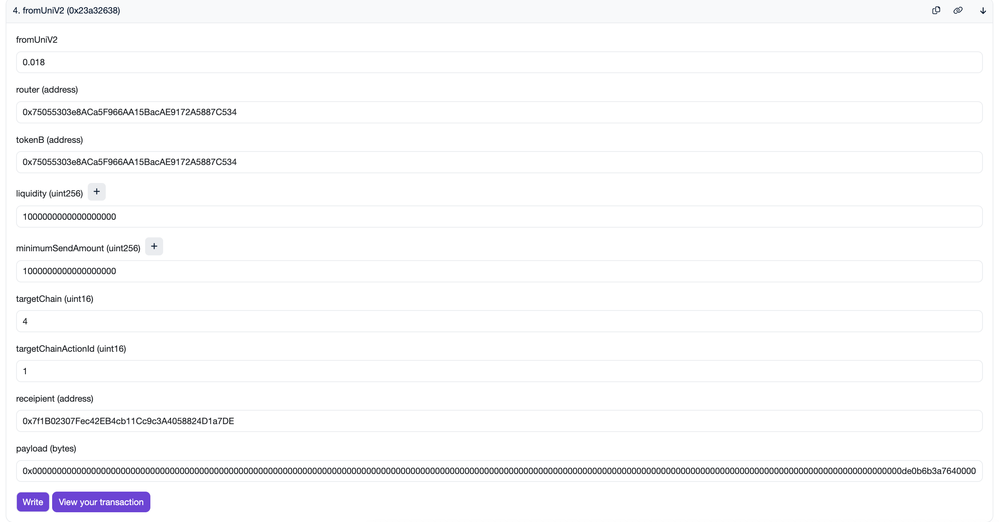

# Alphacado

## Action Id

-   `1`: UniV2TokenAdapter
-   `2`: KlayBankAdapter
-   `3`: KlayStationAdapter
-   `4`: VaultAdapter
-   `5`: UniV2LpAdapter

## Deployed Address

### Mumbai

-   `Alphacado`: 0x147d1Ea2f6Fb25322c3bC91c3D1cFfebc4A55576
-   `Registry`: 0x34907cDDbDFFb0a827FD5cd616e7B43667E56f8C

Adapters:

-   `UniV2LPAdapter`: 0x75055303e8ACa5F966AA15BacAE9172A5887C534
-   `UniV2TokenAdapter`:
    0x23d5aF13518776Ec9875Ef403fcF541b692B2b4d
-   `KlayBankAdapter`:
    0x6DE69a1c333572B9d04631469572F9E5634310d6
-   `KlayStationAdapter`: 0x76CC82Bcff672497bDf60D3034edef6AA8802dD5
-   `VaultAdapter`: 0x6291Cf69a372Fbb68a2dF0C619d1DE52F38bBa8f

### BNB Testnet

-   `Alphacado`: 0x1972308BC7b0fb4e7CF49Ebef14207b07698a2C1
-   `Registry`: 0x6025b9d66D7d86cd9acD2c80318E447b8cA30A68
-   `VaultFactory`: 0x787504d9eEB521D40B12A44dd352C21ccBE569D5

Mock Addresses:

-   `MockKlayBankPool`: 0x8843010C138A3eBF5080C6c6374BeA29A2de9e4C
-   `MockKlayStationPool`:
    0x42E5822795468c746932aA7D8bDBc4168cfb5FB4

Adapters:

-   `UniV2LPAdapter`: 0xBB48201ce454826cecf11424566dbb52307BE0D4
-   `UniV2TokenAdapter`:
    0x3B66E8849F197240bb9ab882025FF9D201063B35
-   `KlayBankAdapter`:
    0x4f66d9428780b7c9e192DA9FB1BFc67fF484de5d
-   `KlayStationAdapter`: 0xeFA7D4F3378a79A0985407b4e36955D54808df87
-   `VaultAdapter`: 0x4Dcd3B1027FDbdeb2f8C5E7fE3Ae52746b9cd3A8

## Simple Working case

Send `fromUniV2` on UniV2Adapters on Mumbai testnet with these following params:

-   msg.value: 0.018 ether
-   router: 0x8954afa98594b838bda56fe4c12a09d7739d179b (UniV2 router)
-   tokenB: 0x87A35f50E570F909F275F5C8AEC40FbeB9e76D17 (any address must work now)
-   liquidity: 10^18 = 1 ether (any amount must work now)
-   minimumSendAmount: 10^18 = 1 ether (any amount must work now)
-   target chain: 4 (BNB Testnet)
-   target chain action Id: 1 (UniV2Adapter)
-   receipient: your address
-   payload: abi encode of (targetChainRouter, targetChainTokenB, targetChainMinimumReceiveLiquidity) (you can use the gen_payload.ts file)

    
