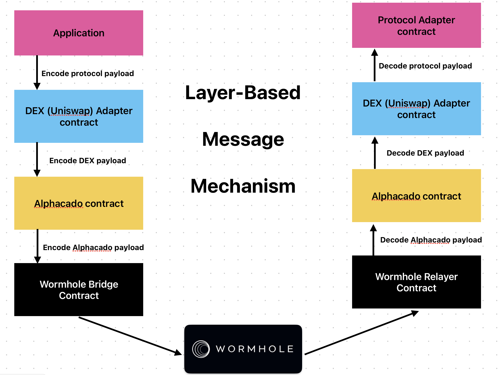

# Alphacado

## Action Id

-   `1`: UniV2TokenAdapter
-   `2`: UniV2LpAdapter
-   `5`: VaultAdapter

## How to send request?



Alphacado use layer-based message mechanism. Each layer has its own type of payload encode-decode. Adapter payload need to be encoded off-chain.

### Uniswap Adapter Payload

#### Token Adapter

When to use this adapter?

Sourchain:
If users has token differ than USDC => use this adapter to swap to USDC

Targetchain:
If users want to receive/interact with other protocol require token differ than USDC => send message to this adapter

Payload schema to encode off-chain when using this adapter on target chain:
`(address router, address tokenB, uint256 minimumReceive, bytes additionActionIdPayload)`

-   `router`: protocol router address to swap on target chain
-   `tokenB`: token to receive when swap from USDC
-   `minimumReceive`: minimum tokenB receive

What is `additionActionIdPayload`?

If user just want to receive token on target chain (which means no other protocol to interact) => `additionActionIdPayload` = "" (an empty string)

Otherwise, `additionActionIdPayload` is the encoded of `(uint16 actionId, bytes additionActionPayload)`

-   See `actionId` list above
-   See how to encode `additionActionPayload` for each protocol below

#### Lp Adapter

When to use this adapter?

Sourchain:
If users has LP => use this adapter to swap to USDC

Targetchain:
If users want to receive/interact other protocol require LP => send message to this adapter

Payload schema to encode off-chain when using this adapter on target chain:
`(address router, address tokenB, uint256 minimumReceiveLiquidity, bytes additionActionIdPayload)`

-   `router`: protocol router address to add liquidity
-   `tokenB`: tokenB in USDC-tokenB pair to add liquidity
-   `minimumReceiveLiquidity`: minimum liquidity receive

What is `additionActionIdPayload`?

If user just want to receive token on target chain (which means no other protocol to interact) => `additionActionIdPayload` = "" (an empty string)

Otherwise, `additionActionIdPayload` is the encoded of `(uint16 actionId, bytes additionActionPayload)`

-   See `actionId` list above
-   See how to encode `additionActionPayload` for each protocol below


## Vault adapter

When to use this adapter: When user want to interact with Alphacado Vault on target chain

-   If user has USDC on source chain: pass these payload directly to alphacado contract (Not implemented)
-   If user has other token or lp: encode this payload in `additionActionPayload` of Uniswap adapter

Payload schema to encode off-chain when using this adapter on target chain:
`(address vault)`

-   `vault`: address of Alphacado Vault

## Example

What if user want to stake token to a vault on Viction that use token differ than USDC:

```typescript
import { AbiCoder } from "ethers"; // use ethersv6
const encodeTokenToVaultViction = (
    targetChainRouter: string,
    targetChainTokenB: string,
    minimumTokenReceive: bigint,
    vaultPool: string
): string => {
    const defaultEncoder = AbiCoder.defaultAbiCoder();
    const vaultPayload = defaultEncoder.encode(
        ["address", "uint256"],
        [vaultAddress, amount],
    );
    const VAULT_ACTION_ID = 5;
    const vaultActionPayload = defaultEncoder.encode(
        ["uint16", "bytes"],
        [VAULT_ACTION_ID, vaultPayload],
    );

    const uniswapTokenPayload = defaultEncoder.encode(
        ["address", "address", "uint256", "bytes"],
        [
            targetChainRouter,
            targetChainTokenB,
            minimumTokenReceive,
            vaultActionPayload,
        ],
    );

    return uniswapTokenPayload;
};
```

## Deployed Address

### Sepolia

-   `Alphacado`: 0x6291Cf69a372Fbb68a2dF0C619d1DE52F38bBa8f
-   `Registry`: 0xF913940686a4Ff79b7efEC95F67f33c32a059F3C
-   `TokenFactory`:
    0x76CC82Bcff672497bDf60D3034edef6AA8802dD5

Adapters:

-   `UniV2LPAdapter`: 0xF149Ee748C2553f2E8D450A27D7c647E28428781
-   `UniV2TokenAdapter`:
    0xF149Ee748C2553f2E8D450A27D7c647E28428781

### Viction testnet 

-   `Alphacado`: 0xb60be58d595e16f3aA517eB88Ea3636bBe14c57F
-   `Registry`: 0x4f66d9428780b7c9e192DA9FB1BFc67fF484de5d
-   `VaultFactory`: 0xBB48201ce454826cecf11424566dbb52307BE0D4
-   `MultipleSwap`: 0x45F55BDBf1451Faa6C77C0A6Bc84C3CC6919Ea39

Adapters:

-   `UniV2LPAdapter`: 0xeFA7D4F3378a79A0985407b4e36955D54808df87
-   `UniV2TokenAdapter`: 0xeFA7D4F3378a79A0985407b4e36955D54808df87
-   `VaultAdapter`: 0x2a4003A7992A0345ebF85cD062833de72583a236
